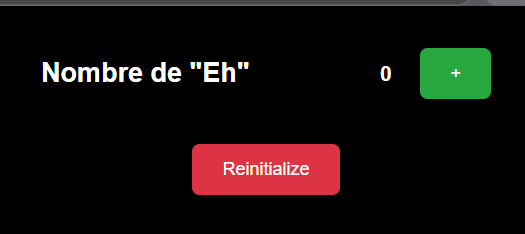
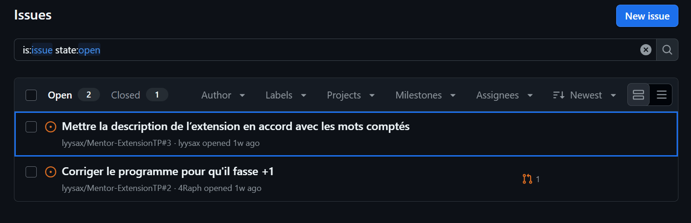
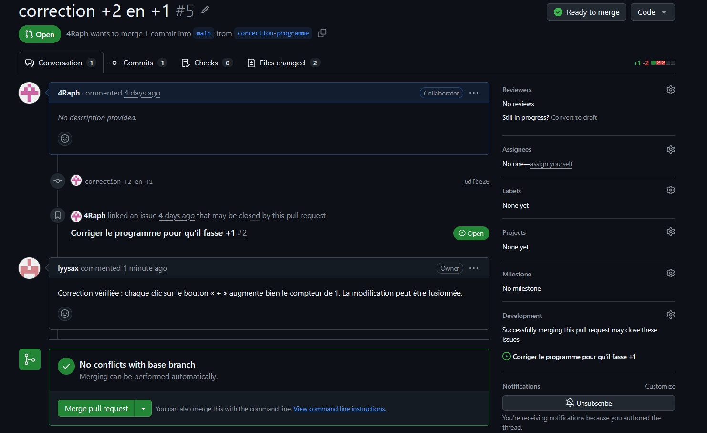
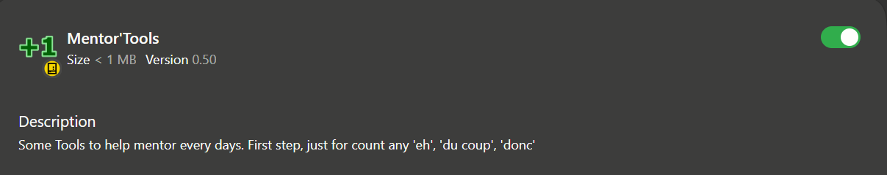
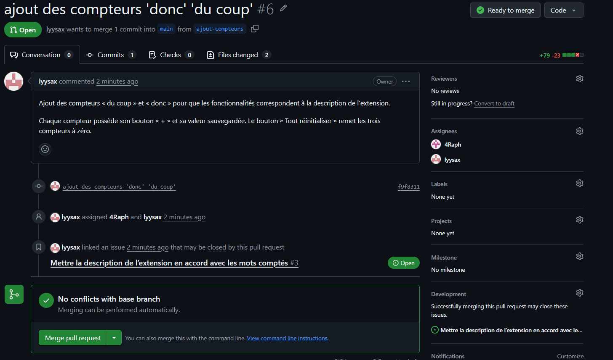
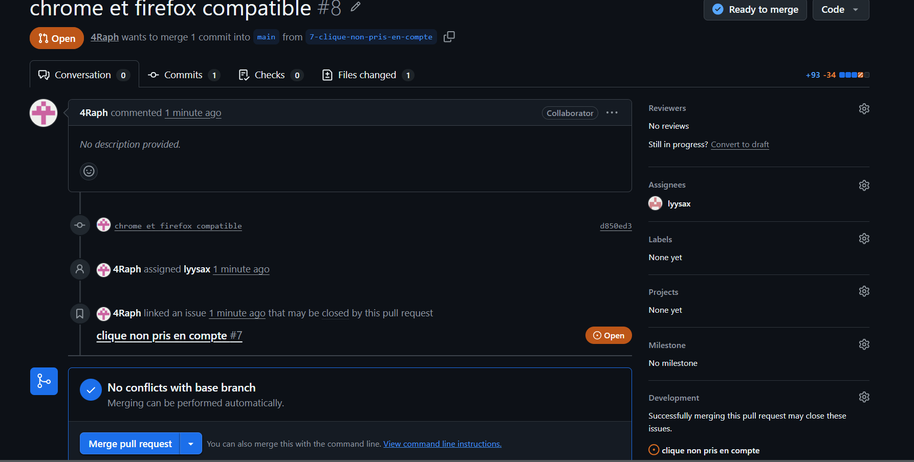
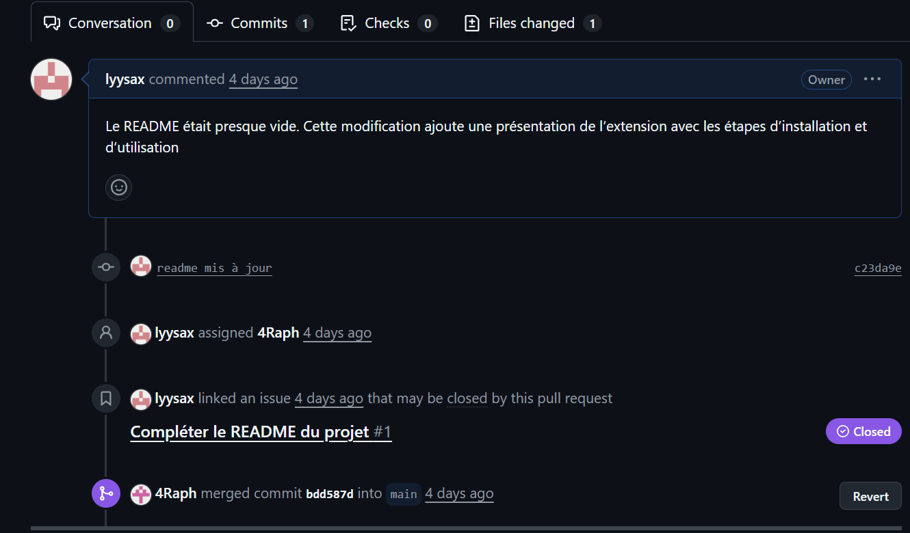

# Compte rendu de TP — Contributions sur GitHub

**Membres du groupe :** Lisa Anton, Raphaël Osmont

## 1. Présentation du projet

Mentor Extension est une extension de navigateur proposant des outils pour accompagner les mentors au quotidien. Au début du TP, elle disposait uniquement d’un compteur pour les « eh ».

L’objectif du TP est d’identifier des améliorations ou problèmes, de créer les issues correspondantes et de proposer des modifications avec des pull requests. Il comprend également la review des modifications et la rédaction de documentation.

**Dépôt d’origine :** https://github.com/Hyuga974/Mentor-Extension  
**Notre fork :** https://github.com/lyysax/Mentor-ExtensionTP

## 2. Préparation du travail

Nous avons créé un fork du dépôt d’origine, puis récupéré le projet sur notre ordinateur. Nous avons ensuite installé l’extension dans le navigateur et testé son fonctionnement.

## 3. Création des issues

Après avoir pris connaissance du projet, nous avons créé trois premières issues. Une quatrième a ensuite été ajoutée à la suite d’un problème constaté sur Firefox.

Chaque issue comporte un titre, une description du problème et le résultat attendu.

Sur cette capture, l’une des issues apparaît dans l’onglet **Closed**.

## 4. Issue — Corriger l’incrémentation du compteur

Lors de l’utilisation du compteur « eh », un clic augmentait sa valeur de 2 au lieu de 1.

Nous avons créé la branche **correction-programme** pour effectuer la correction.

Après avoir effectué un commit et un push sur cette branche, nous avons ouvert une pull request.

## 5. Issue — Ajouter les compteurs manquants

La description annonçait des compteurs pour « eh », « du coup » et « donc ». Cependant, seul le compteur « eh » était disponible dans l’extension.

Deux solutions ont été proposées dans l’issue :

- Corriger la description pour mentionner uniquement le compteur « eh ».
- Ajouter les compteurs « du coup » et « donc ».

Nous avons décidé d’ajouter les deux compteurs sur la branche **ajout-compteurs**, puis ouvert une pull request vers la branche **main**.

## 6. Issue — Corriger le fonctionnement des boutons sur Firefox

Lors d’un test sur Firefox, nous avons constaté que les clics sur le bouton « + » n’augmentaient pas le compteur. Le problème n’était pas reproduit sur Microsoft Edge.

Nous avons créé une nouvelle issue pour signaler cette différence de fonctionnement entre les navigateurs, puis ouvert une pull request proposant une correction.

## 7. Issue — Compléter le README

Le README était presque vide et ne précisait pas comment installer et utiliser l’extension.

Nous avons créé la branche **docs/complete-readme**, puis complété le README avec une présentation du projet et les étapes d’installation et d’utilisation. Nous avons également ajouté l’architecture du projet.

Après avoir effectué un commit et un push sur cette branche, nous avons ouvert une pull request.

## 8. Documentation du projet

Nous joignons trois documents au rendu :

- **README.md** : présentation, architecture, prérequis, installation et utilisation du projet. A la racine du dossier <u>**rendu**</u>
- **ADR** : contexte, décision technique, alternatives envisagées et conséquences.
  A la racine du dossier <u>**rendu** </u>
- **Documentation utilisateur — premier jet** : instructions destinées à une personne non développeuse pour installer et utiliser l’extension.
  A la racine du dossier <u>**rendu**</u>

## 9. Bilan

Ce TP nous a permis de pratiquer la création d’issues, le travail sur des branches dédiées, les commits, les push et les pull requests.

Nous avons également travaillé sur la relecture des modifications et sur la documentation du projet pour faciliter sa prise en main.

Nous n’avons pas rencontré de difficulté particulière dans la réalisation du TP.
